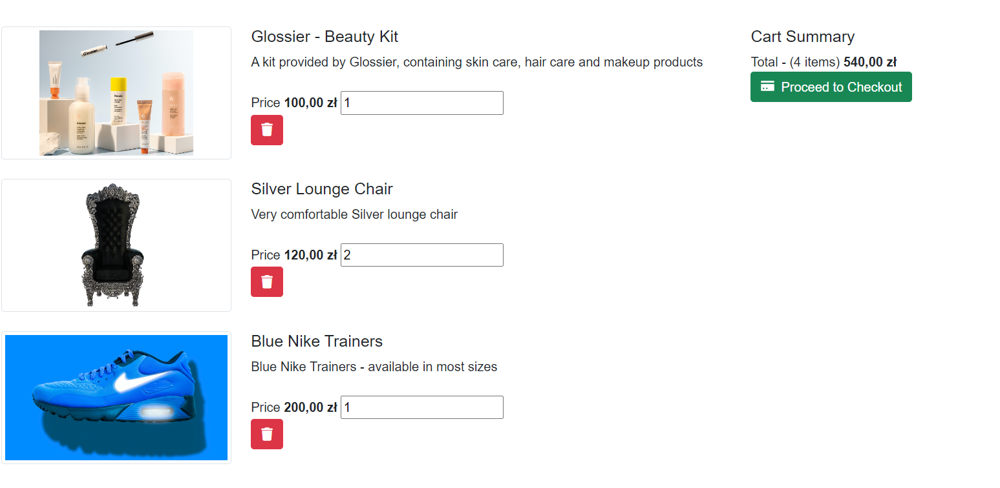

# Online Shopping App

## Introduction

Welcome to the Online Shopping App, a comprehensive solution for creating and managing an online store. This application is built using modern web technologies.

## Features

- **Product Management**: Add, update, and delete products with ease.
- **Shopping Cart**: Users can add products to their cart and manage quantities.
- **Order Management**: View and manage customer orders.
- **Responsive Design**: Optimized for both desktop and mobile devices.

## Screenshots

### Home Page


### Product Listing by Category


### Shopping Cart



## Getting Started

### Prerequisites

- [.NET Core SDK](https://dotnet.microsoft.com/download)

### Installation

1. **Clone the repository**:
    ```bash
    git clone https://github.com/KlonicaRadoslaw/online-shopping-app.git
    cd online-shopping-app
    ```

2. **Restore dependencies**:
    ```bash
    dotnet restore
    ```

3. **Update the database**:
    ```bash
    dotnet ef database update
    ```

4. **Run the application**:
    ```bash
    dotnet run
    ```

## Project Structure

online-shopping-app/
│
├── online-shoping-app-solution/
│ ├── online-shoping-app.Api/
│ ├── online-shoping-app.web/
│ ├── online-shoping.Models/
│ ├── online-shoping-app-solution.sln
│
├── .gitignore
├── README.md

- **`online-shoping-app-solution/`**: Main solution directory.
  - **`online-shoping-app.Api/`**: Backend API.
  - **`online-shoping-app.web/`**: Frontend web application.
  - **`online-shoping.Models/`**: Shared models and DTOs.